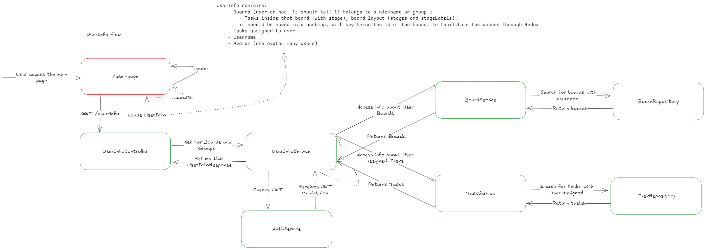
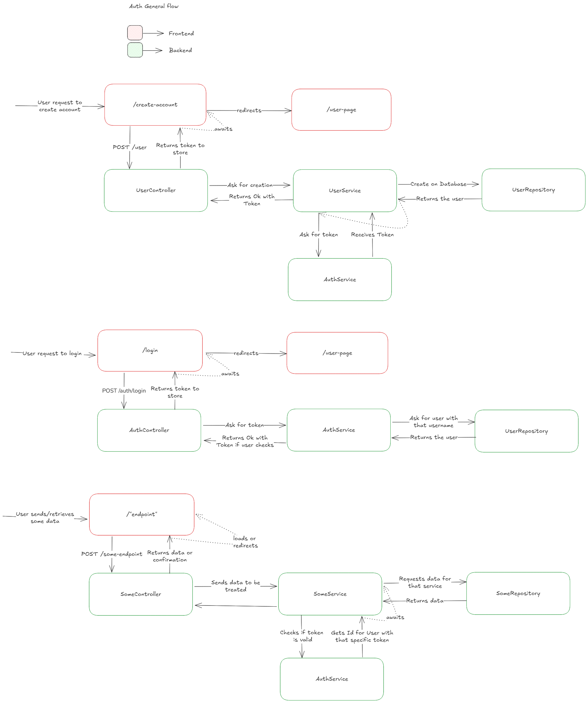
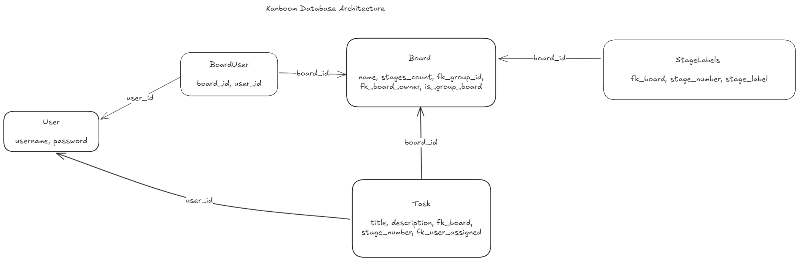
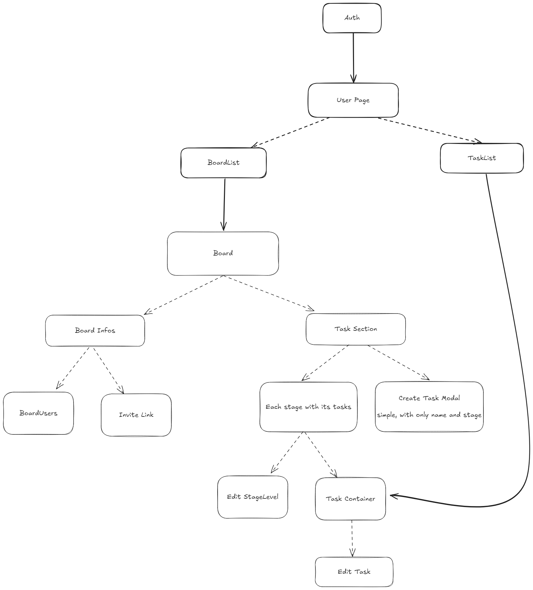

# kanboom

Kanboom is an open-source task management system designed to empower individuals and teams to organize their tasks efficiently using the Kanban methodology. It provides a reliable, customizable, and open-source solution for visualizing and managing work progress. Kanboom allows users to create boards, define custom stages, and collaborate seamlessly by inviting team members and assigning tasks.

**Why Kanboom?**

Kanboom aims to provide a straightforward and effective Kanban experience. It emphasizes simplicity and reliability, offering a robust platform for task management without unnecessary complexity. It's built for those who value open-source solutions and want a customizable tool to fit their specific workflow.

**Target Audience:**

* Individuals seeking personal task organization.
* Small to medium-sized teams requiring collaborative task management.
* Developers and project managers looking for a customizable Kanban system.

## Tech Stack

* **Backend:** .NET 8 (C#) - Chosen for its performance, robust ecosystem, and strong community support.
* **Frontend:** React with Redux and Next.js (latest version) - Selected for its component-based architecture, efficient state management, and server-side rendering capabilities.
* **Database:** PostgreSQL- Chosen for reliability, being open-source and familiarity.
* **Authentication:** JWT (JSON Web Tokens) - Implemented for secure and stateless authentication.
* **Containerization:** Docker (planned for local development and deployment)

## Features

* **Customizable Boards:** Create and manage multiple boards with personalized stages.
* **Task Management:** Create, assign, edit, and track tasks across various stages.
* **User Collaboration:** Invite users, assign tasks, and manage permissions within boards.
* **Board Ownership:** Transfer board ownership to other users.
* **Flexible Stages:** Customize stages within boards, including renaming and deleting stages.

* **Invite Links:** Generate invitation links for users to join boards.
* **User Scoped Data:** Users only access data within their assigned scope, ensuring privacy.

## Getting Started

### Prerequisites

* Node.js v18 or later
* .NET 8 SDK
* PostgreSQL
* Git
* Docker (optional, for local development)

### Installation

1.  Clone the repository: `git clone [repository URL]`
2.  Navigate to the frontend directory: `cd frontend`
3.  Install frontend dependencies: `npm install`
4.  Navigate to the backend directory: `cd backend`
5.  Install backend dependencies: `dotnet restore`
6.  Set up your database and create the necessary tables (refer to the database schema).
7.  Configure environment variables (see below).

### Quick Start

1.  Start the database.
2.  Navigate to the backend directory and run: `dotnet run`
3.  Navigate to the frontend directory and run: `npm run dev`

## Architecture Overview

* **User Basic Info Architecture:**



* **Authentication Flow:** 



* **Database Schema:**
    * **Key Relationships:**
        * A Board belongs to a User (the owner).
        * A Board can have many Tasks.
        * A Task belongs to a Stage.
        * A Board has customizable Stages.
        * A Board can have multiple Users.
        * Tasks are assigned to Users.




* **User Flowchart:**



## API Documentation

### Authentication

* **POST /auth/login**
    * Description: Authenticates a user and returns a JWT token
    * Request Body:
        ```json
        {
            "apiKey": "string",
            "username": "string",
            "passwordHash": "string"
        }
        ```
    * Response: Returns the token
    <br>
* **POST /auth/persist**
    * Description: Validates and refreshes an existing authentication token
    * Request Body:
        ```json
        {
            "apiKey": "string",
            "token": "string"
        }
        ```
    * Response: Returns the username

### Boards

* **POST /board**
    * Description: Retrieves detailed information about a specific board
    * Request Body:
        ```json
        {
            "apiKey": "string",
            "token": "string",
            "boardId": 0
        }
        ```
    * Response: Returns complete board details including stages, tasks, and users
    <br>
* **POST /board/create**
    * Description: Creates a new board
    * Request Body:
        ```json
        {
            "apiKey": "string",
            "token": "string",
            "name": "string"
        }
        ```
    * Response: Returns the newly created board details
    <br>
* **PATCH /board/changeOwner**
    * Description: Transfers board ownership to another user
    * Request Body:
        ```json
        {
            "apiKey": "string",
            "token": "string",
            "boardId": 0,
            "owner": 0
        }
        ```
    * Response: Returns updated board details
    <br>
* **POST /board/addStage**
    * Description: Adds a new stage/column to the board
    * Request Body:
        ```json
        {
            "apiKey": "string",
            "token": "string",
            "boardId": 0,
            "stageNumber": 0,
            "stageName": "string"
        }
        ```
    * Response: Returns updated board details
    <br>
* **DELETE /board/deleteStage**
    * Description: Removes a stage/column from the board
    * Request Body:
        ```json
        {
            "apiKey": "string",
            "token": "string",
            "boardId": 0,
            "stageNumber": 0,
            "stageName": "string"
        }
        ```
    * Response: Returns updated board details
    <br>
* **PATCH /board/renameStage**
    * Description: Renames an existing stage/column
    * Request Body:
        ```json
        {
            "apiKey": "string",
            "token": "string",
            "boardId": 0,
            "stageNumber": 0,
            "stageName": "string"
        }
        ```
    * Response: Returns updated board details

### Board Users

* **POST /boardUser/invite**
    * Description: Accepts a board invitation using an invite code
    * Request Body:
        ```json
        {
            "apiKey": "string",
            "token": "string",
            "invite": "string"
        }
        ```
    * Response: Returns board details after joining
    <br>
* **DELETE /boardUser/leave**
    * Description: Removes the current user from a board
    * Request Body:
        ```json
        {
            "apiKey": "string",
            "token": "string",
            "boardId": 0
        }
        ```
    * Response: Returns success confirmation

### Tasks

* **POST /task/create**
    * Description: Creates a new task on a board
    * Request Body:
        ```json
        {
            "apiKey": "string",
            "token": "string",
            "title": "string",
            "description": "string",
            "fk_Board": 0,
            "fk_UserAssignee": 0
        }
        ```
    * Response: Returns the created task details
    <br>
* **PATCH /task/edit**
    * Description: Modifies an existing task's details
    * Request Body:
        ```json
        {
            "apiKey": "string",
            "token": "string",
            "id": 0,
            "fk_Board": 0,
            "title": "string",
            "description": "string",
            "fk_UserAssignee": 0
        }
        ```
    * Response: Returns updated task details
    <br>
* **PATCH /task/changeVisibility**
    * Description: Toggles task visibility
    * Request Body:
        ```json
        {
            "apiKey": "string",
            "token": "string",
            "id": 0,
            "fk_Board": 0,
            "hidden": true
        }
        ```
    * Response: Returns updated task details
    <br>
* **PATCH /task/changeStage**
    * Description: Moves a task to a different stage/column
    * Request Body:
        ```json
        {
            "apiKey": "string",
            "token": "string",
            "id": 0,
            "fk_Board": 0,
            "stage": 0
        }
        ```
    * Response: Returns updated task details
    <br>
* **PATCH /task/changeAssignee**
    * Description: Reassigns a task to a different user
    * Request Body:
        ```json
        {
            "apiKey": "string",
            "token": "string",
            "id": 0,
            "fk_Board": 0,
            "assignee": 0
        }
        ```
    * Response: Returns updated task details

### Users

* **POST /user**
    * Description: Retrieves current user's profile and associated data
    * Request Body:
        ```json
        {
            "apiKey": "string",
            "token": "string"
        }
        ```
    * Response: Returns user profile, boards, and tasks
    <br>
* **POST /user/create**
    * Description: Creates a new user account
    * Request Body:
        ```json
        {
            "apiKey": "string",
            "username": "string",
            "passwordHash": "string",
            "email": "string"
        }
        ```
    * Response: Returns new user details and authentication token

### Response Format

All endpoints return responses in the following format, with additional data specific information to the endpoint:

```json
{
    "success": true,
    "message": "string",
    "exception": "string",
    "errors": ["string"],
}
```
<br>

## Security

* **JWT Authentication:** All requests to the API are protected with JWT tokens.
* **Password Hashing:** Passwords are currently hashed using MD5.
* **SQL Injection Protection:** The application uses parameterized queries to prevent SQL injection attacks. .NET automatically handles most SQL injection protection.

## Future Plans (Postponed)

* **[Feature] Group:** A group can own a board, and users can join multiple groups.
* **[Feature] Multiple Admins:** Allow boards to have additional admins beyond the owner.
* **[Feature] Board Abbreviations:** Users can assign custom abbreviations to boards.
* **[Feature] Task Tagging:** Automatically assign task tags based on the board abbreviation and task index.
* **[Architecture] Redis:** Create cache implementation.
* **[Architecture] RabbitMQ:** Send emails using RabbitMQ and some mailing libraty to notify users on task changes.
* **[Architecture] Kubernetes:** Docker + Kubernetes + Tilt implementation.

## Docker Setup

The app can be run locally with Docker using the provided `docker-compose.yml` file. This will set up both the frontend and backend services.

## CI/CD and Logging

CI/CD setup and logging features will be implemented in future versions of the application to automate deployments and ensure robust error tracking.

## Contributing

Kanboom is open-source, and contributions are welcome! Feel free to fork the repository, make changes, and create pull requests. Make sure to follow the coding standards and add tests where applicable.

## License

This project is licensed under the MIT License - see the `LICENSE` file for details.

## Contact

For any questions or suggestions, please feel free to reach out through hugofolloni@gmail.com.